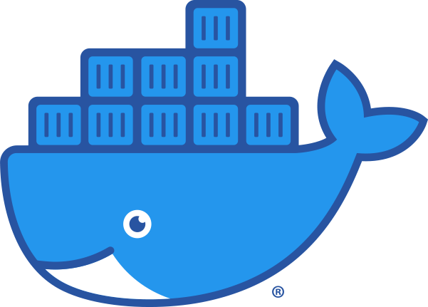
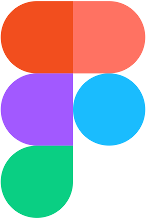

<!---
<h1 >Hi 👋, I'm Muhammad Naqeeb</h1>
-->

<!---
I am a mobile programming enthusiast and a senior  **software engineer** with a **B.Sc**. in Computer Science. With a deep passion for **mobile app development**.
Passionate and results-driven Software Developer with a strong
foundation in Computer Science and a proven track record in designing
and developing high-quality mobile applications using **Flutter**. 
-->

###

  

- 🔭 I’m currently working on **DevOps**

- 👨‍💻 All of my projects are available at [**github.com/muhammadnaqeeb**](https://github.com/muhammadnaqeeb)

- 📝 I regularly write articles on [**medium.com/@muhammadnaqeeb**](https://medium.com/@muhammadnaqeeb)

- 💬 Ask me about **Flutter, dart, Android ...**

- 📫 How to reach me **mnaqeeb512@gmail.com**

- 📄 Know about my experiences [**portfolio**](https://mnaqeeb-dev.web.app/)

- ⚡ Fun fact **I think I can teach well**

<h3 align="left">Connect with me:</h3>

<h3 align="left">Languages and Tools:</h3>

 

  

